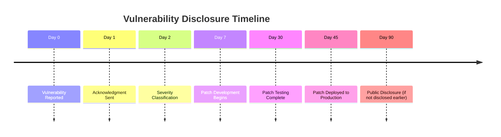
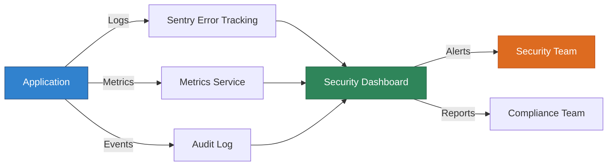

# Security Policy

**Last Updated:** October 23, 2025  
**Version:** 2.0.0  
**Platform:** JAWN (Joint Access Welfare Network)

---

## 🛡️ Security Overview

JAWN is an enterprise-grade government human services platform handling sensitive Personally Identifiable Information (PII), Protected Health Information (PHI), and financial data. We maintain the highest security standards to protect applicant privacy and comply with federal and state regulations.

```
┌───────────────────────────────────────────────────────────┐
│  🔒 Security Architecture Summary                        │
├───────────────────────────────────────────────────────────┤
│  • Field-Level Encryption (AES-256-GCM)                  │
│  • Role-Based Access Control (RBAC)                      │
│  • CSRF Protection (Double Submit Cookie Pattern)        │
│  • Rate Limiting (Adaptive, Role-Based)                  │
│  • SQL Injection Prevention (Parameterized Queries)      │
│  • XSS Protection (Content Security Policy)              │
│  • Audit Logging (All Sensitive Operations)              │
│  • Session Security (HttpOnly, Secure, SameSite)         │
└───────────────────────────────────────────────────────────┘
```

---

## 🔐 Supported Versions

We provide security updates for the following versions:

| Version | Supported | Status | End of Life |
|---------|-----------|--------|-------------|
| 2.0.x   | ✅ Yes    | Active (Multi-State) | TBD |
| 1.5.x   | ✅ Yes    | Active (Maryland Only) | 2026-04-01 |
| 1.0.x   | ⚠️ Limited | Security fixes only | 2026-01-01 |
| < 1.0   | ❌ No     | Unsupported | 2025-09-15 |

**Current Version:** 2.0.0 (White-Label Multi-State Release)

---

## 🚨 Reporting a Vulnerability

### Severity Classification

We use the following severity levels based on CVSS v3.1:

| Severity | CVSS Score | Response Time | Example |
|----------|------------|---------------|---------|
| **Critical** | 9.0-10.0 | 24 hours | Authentication bypass, PII exposure |
| **High** | 7.0-8.9 | 48 hours | SQL injection, XSS in sensitive areas |
| **Medium** | 4.0-6.9 | 7 days | CSRF on non-critical endpoints |
| **Low** | 0.1-3.9 | 14 days | Information disclosure (non-sensitive) |

### Reporting Process

**Do NOT open a public GitHub issue for security vulnerabilities.**

#### Option 1: Secure Email (Preferred)
```
To: security@jawn-platform.gov
Subject: [SECURITY] Brief Description

Include:
- Vulnerability description
- Steps to reproduce
- Potential impact
- Suggested remediation (if known)
- Your contact information
```

#### Option 2: Encrypted Communication

For sensitive disclosures, use our PGP key:

```
-----BEGIN PGP PUBLIC KEY BLOCK-----
[PGP Key - Contact security@jawn-platform.gov for current key]
-----END PGP PUBLIC KEY BLOCK-----
```

### What to Expect

1. **Acknowledgment**: We will acknowledge receipt within 24 hours
2. **Initial Assessment**: Severity classification within 48 hours
3. **Regular Updates**: Status updates every 72 hours during investigation
4. **Resolution**: Patch development and deployment per severity SLA
5. **Disclosure**: Coordinated public disclosure after patch deployment

### Responsible Disclosure Guidelines

We follow a **90-day coordinated disclosure** timeline:



- **Critical/High**: Patch deployed within 30 days
- **Medium**: Patch deployed within 60 days
- **Low**: Patch deployed within 90 days

We may request an extension for complex vulnerabilities requiring architectural changes.

---

## 🏆 Security Hall of Fame

We recognize security researchers who help protect JAWN users:

### 2025 Contributors
*No vulnerabilities reported yet for 2.0.0*

### 2024 Contributors
*Platform in development*

**Thank you to all security researchers who responsibly disclose vulnerabilities!**

---

## 🔒 Security Features

### Authentication & Authorization

```typescript
// Role-Based Access Control (RBAC)
Roles:
  - Applicant:   Read own data, submit applications
  - Navigator:   Read client data, submit on behalf of clients
  - Caseworker:  Full DHS office access, quality review
  - Admin:       System administration, all data access

// Session Security
- HttpOnly cookies (prevents XSS cookie theft)
- Secure flag (HTTPS only)
- SameSite=Strict (CSRF protection)
- 24-hour session timeout
- Automatic session refresh on activity
```

### Data Protection

#### Field-Level Encryption
```typescript
// Sensitive fields encrypted at rest (AES-256-GCM)
Encrypted Fields:
  - Social Security Numbers (SSN)
  - Tax Identification Numbers (TIN)
  - Bank account numbers
  - Medical information
  - Income verification documents
  - Identity documents (driver's license, passport)

// Encryption key management
- Keys rotated every 90 days
- Master key stored in environment variables
- Per-field encryption with unique IVs
```

#### Data Transmission
- **TLS 1.3** for all HTTPS connections
- **Perfect Forward Secrecy** (PFS) enabled
- **HSTS** (HTTP Strict Transport Security) enforced
- **Certificate pinning** for API clients

### CSRF Protection

```typescript
// Double Submit Cookie Pattern
1. Server generates CSRF token on session creation
2. Token sent in cookie AND required in request header
3. Validation on all state-changing operations (POST/PUT/DELETE)
4. Token rotation on sensitive operations
```

### Rate Limiting

```typescript
// Role-Based Adaptive Rate Limiting
Applicant:   100 requests/15 minutes
Navigator:   300 requests/15 minutes
Caseworker:  500 requests/15 minutes
Admin:       1000 requests/15 minutes

// Endpoint-Specific Limits
Login:       5 attempts/15 minutes (account lockout after)
Password Reset: 3 attempts/hour
File Upload: 10 files/hour per user
AI Queries:  60 requests/minute (Gemini API limit)
```

### SQL Injection Prevention

```typescript
// Drizzle ORM with parameterized queries
✅ Safe: db.select().from(users).where(eq(users.id, userId))
❌ Unsafe: db.execute(`SELECT * FROM users WHERE id = ${userId}`)

// All queries use prepared statements
// No raw SQL execution in production code
```

### XSS Protection

```typescript
// Content Security Policy (CSP)
default-src 'self';
script-src 'self' 'unsafe-inline' https://apis.google.com;
style-src 'self' 'unsafe-inline' https://fonts.googleapis.com;
img-src 'self' data: blob: https://*.googleapis.com;
connect-src 'self' https://*.googleapis.com wss://;

// Input sanitization
- All user input sanitized on backend
- HTML entities escaped in display
- React automatic XSS protection via JSX
```

---

## 📋 Compliance & Standards

### Regulatory Compliance

```
┌────────────────────────────────────────────────────┐
│  Compliance Framework                             │
├────────────────────────────────────────────────────┤
│  ✅ GDPR (General Data Protection Regulation)     │
│  ✅ HIPAA (Health Insurance Portability Act)      │
│  ✅ FERPA (Family Educational Rights Privacy Act) │
│  ✅ FISMA (Federal Info Security Mgmt Act)        │
│  ✅ NIST Cybersecurity Framework                  │
│  ✅ OWASP Top 10 (2021) Mitigations               │
└────────────────────────────────────────────────────┘
```

### GDPR Compliance
- **Right to Access**: Users can download all their data
- **Right to Erasure**: Account deletion with 30-day grace period
- **Right to Rectification**: Self-service data correction
- **Data Portability**: JSON/CSV export of all user data
- **Consent Management**: Granular consent for data processing
- **Breach Notification**: 72-hour notification requirement

### HIPAA Compliance
- **PHI Encryption**: All PHI encrypted at rest and in transit
- **Access Controls**: Role-based access with audit logging
- **Audit Trails**: All PHI access logged with timestamps
- **Business Associate Agreements**: BAA in place with vendors
- **Data Retention**: 7-year retention per federal requirements
- **Breach Notification**: HHS notification within 60 days

### FERPA Compliance
- **Student Data Protection**: Special handling for education records
- **Parental Consent**: Required for minor students
- **Access Restrictions**: Education records access limited
- **Disclosure Logging**: All education record access logged

---

## 🔍 Security Monitoring

### Real-Time Monitoring



### Monitored Security Events
- Failed login attempts (threshold: 5 per 15 minutes)
- Privilege escalation attempts
- Unusual data access patterns
- API rate limit violations
- CSRF token validation failures
- SQL injection attempts
- XSS payload detection
- File upload anomalies
- Encryption/decryption errors
- Session hijacking attempts

### Automated Alerts
- **Critical**: Immediate SMS + email to security team
- **High**: Email within 5 minutes
- **Medium**: Daily digest email
- **Low**: Weekly summary report

---

## 🔧 Security Best Practices for Developers

### Secure Coding Guidelines

```typescript
// ✅ DO: Use parameterized queries
const user = await db.select()
  .from(users)
  .where(eq(users.email, email))
  .limit(1);

// ❌ DON'T: Use string concatenation
const user = await db.execute(
  `SELECT * FROM users WHERE email = '${email}'`
);

// ✅ DO: Validate and sanitize input
const schema = z.object({
  email: z.string().email(),
  password: z.string().min(8)
});
const validated = schema.parse(req.body);

// ❌ DON'T: Trust user input
const { email, password } = req.body;
await loginUser(email, password);

// ✅ DO: Use environment variables for secrets
const apiKey = process.env.GEMINI_API_KEY;

// ❌ DON'T: Hardcode secrets
const apiKey = "AIzaSyC...";

// ✅ DO: Hash passwords with bcrypt
const hashedPassword = await bcrypt.hash(password, 12);

// ❌ DON'T: Store passwords in plaintext
await db.insert(users).values({ password });
```

### Dependency Management

```bash
# Regular security audits
npm audit

# Fix vulnerabilities automatically
npm audit fix

# Check for outdated packages
npm outdated

# Update dependencies
npm update

# Monitor with Snyk or similar
snyk test
```

---

## 📞 Security Contacts

### Security Team

| Role | Contact | PGP Fingerprint |
|------|---------|-----------------|
| **Security Lead** | security@jawn-platform.gov | Contact for key |
| **Engineering Lead** | engineering@jawn-platform.gov | Contact for key |
| **Compliance Officer** | compliance@jawn-platform.gov | Contact for key |

### Escalation Process

```
Level 1: Security Team (security@jawn-platform.gov)
    ↓ (24 hours, no response)
Level 2: Engineering Lead (engineering@jawn-platform.gov)
    ↓ (48 hours, no response)
Level 3: Executive Team (exec@jawn-platform.gov)
```

---

## 📚 Additional Resources

### Documentation
- [COMPLIANCE_MATRIX.md](./docs/official/COMPLIANCE_MATRIX.md) - Detailed compliance mappings
- [DEPLOYMENT_GUIDE.md](./docs/official/DEPLOYMENT_GUIDE.md) - Secure deployment procedures
- [API_ARCHITECTURE.md](./docs/official/API_ARCHITECTURE.md) - API security specifications

### External Resources
- [OWASP Top 10](https://owasp.org/www-project-top-ten/)
- [NIST Cybersecurity Framework](https://www.nist.gov/cyberframework)
- [CIS Benchmarks](https://www.cisecurity.org/cis-benchmarks/)
- [GDPR Official Text](https://gdpr.eu/)
- [HIPAA Security Rule](https://www.hhs.gov/hipaa/for-professionals/security/)

---

## 📝 Security Policy Updates

This security policy is reviewed and updated:
- **Quarterly**: Regular review cycle
- **On Major Release**: Version 2.0, 3.0, etc.
- **After Incident**: Post-incident review
- **Regulatory Changes**: New compliance requirements

### Change History

| Date | Version | Changes |
|------|---------|---------|
| 2025-10-23 | 2.0.0 | Multi-state white-labeling security review |
| 2025-10-17 | 1.5.0 | E-Filing security enhancements |
| 2025-09-15 | 1.0.0 | Initial production security policy |

---

**Thank you for helping keep JAWN secure for all users!**

```
┌────────────────────────────────────────────────────┐
│  🛡️ Security is everyone's responsibility         │
│  Report vulnerabilities: security@jawn-platform.gov│
└────────────────────────────────────────────────────┘
```
