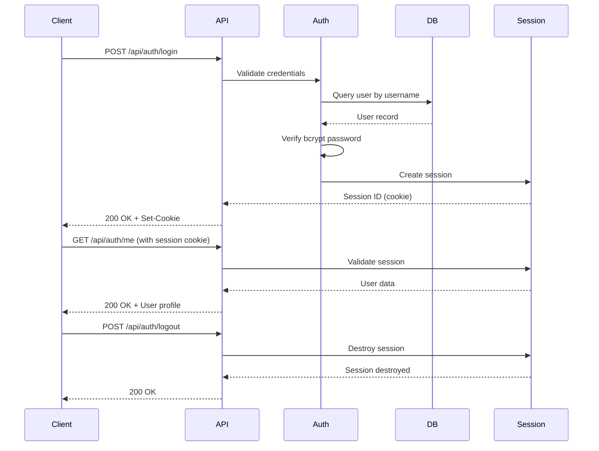
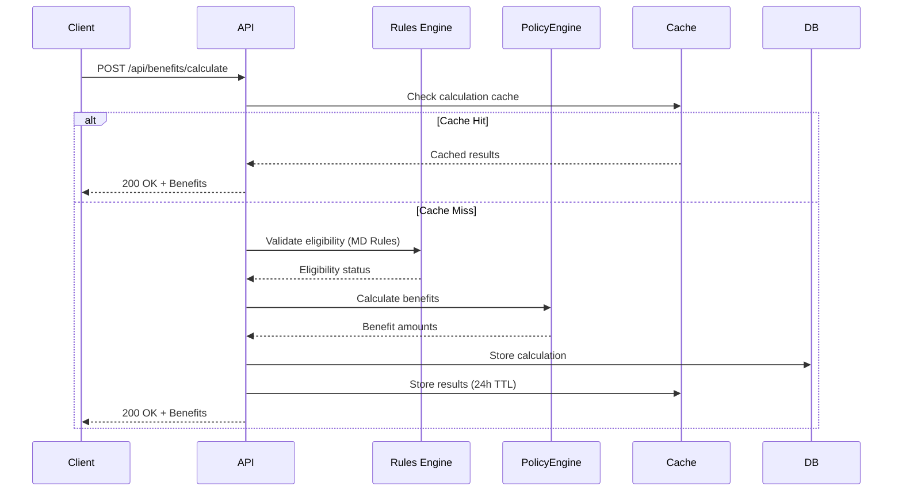
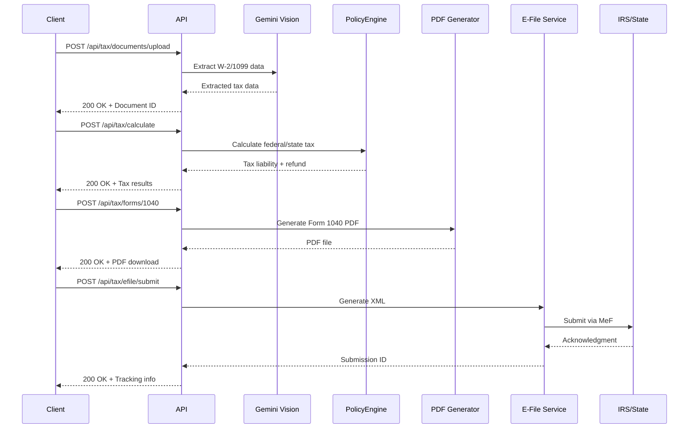
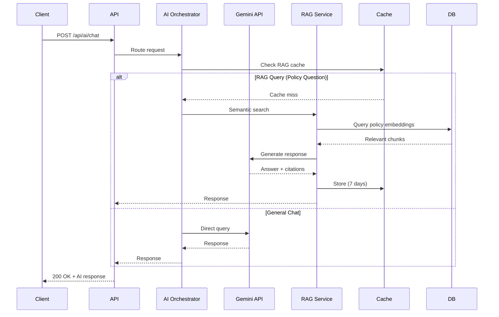
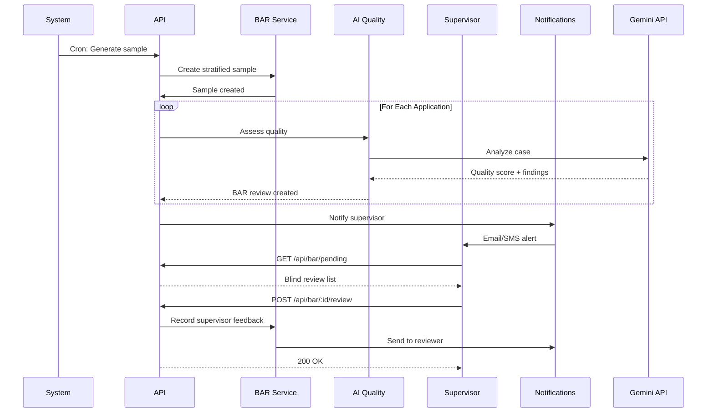
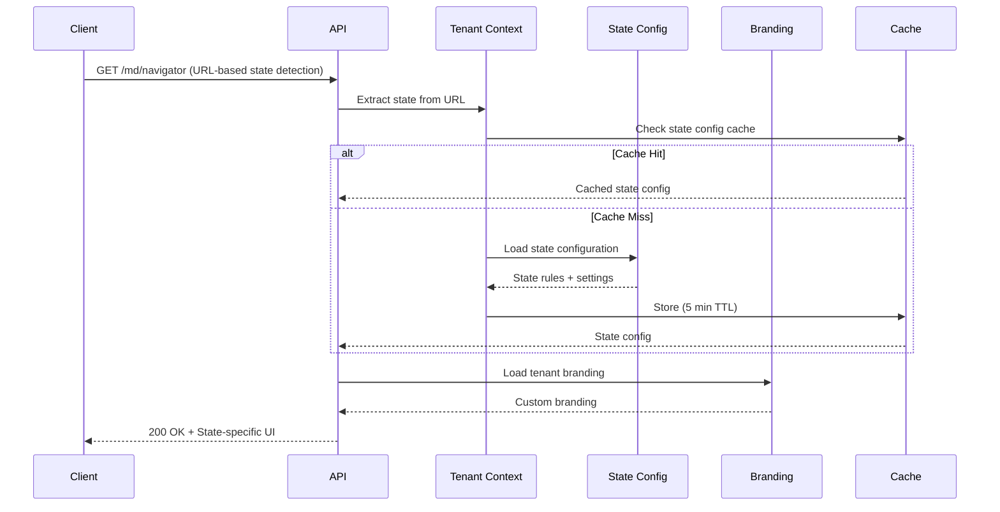

# API Architecture Documentation

**Last Updated:** October 23, 2025  
**Version:** 2.0.0  
**Platform:** JAWN (Joint Access Welfare Network)  
**Total Endpoints:** 367

---

## 📊 API Overview

```
┌─────────────────────────────────────────────────────────────┐
│  RESTful API Architecture Summary                           │
├─────────────────────────────────────────────────────────────┤
│  Total Endpoints: 367                                       │
│  Framework: Express.js + TypeScript                         │
│  Authentication: Session-based + RBAC                       │
│  Rate Limiting: Role-based adaptive throttling              │
│  Documentation: OpenAPI 3.0 (Swagger)                       │
│  Base URL: https://api.jawn-platform.gov/api               │
└─────────────────────────────────────────────────────────────┘
```

### Endpoint Distribution by Domain

| Domain | Endpoints | Description |
|--------|-----------|-------------|
| **Authentication & Users** | 12 | Login, register, sessions, roles |
| **Benefits & Eligibility** | 45 | SNAP, Medicaid, TANF, OHEP, Tax Credits, SSI |
| **Tax Preparation** | 32 | VITA intake, Form 1040, state forms, e-filing |
| **Documents** | 38 | Upload, OCR, classification, verification |
| **AI Services** | 42 | Intake assistant, RAG, cross-enrollment, predictions |
| **Quality & BAR** | 28 | Benefits Access Review, supervisor review, QC |
| **Multi-Tenant** | 18 | State configs, county tenants, branding |
| **Notifications** | 15 | WebSocket, email, SMS, preferences |
| **Legislative Tracking** | 25 | Federal bills, state laws, policy changes |
| **Monitoring & Admin** | 35 | Metrics, health checks, analytics, caching |
| **Developer Platform** | 22 | API keys, webhooks, integration management |
| **Miscellaneous** | 55 | Appointments, forms, reports, exports |

---

## 🔐 Authentication Flow



### Authentication Endpoints

```typescript
POST   /api/auth/register       // Create new user account
POST   /api/auth/login          // Authenticate user
POST   /api/auth/logout         // End session
GET    /api/auth/me             // Get current user
PUT    /api/auth/profile        // Update user profile
POST   /api/auth/password       // Change password
POST   /api/auth/reset-request  // Request password reset
POST   /api/auth/reset-confirm  // Confirm password reset
GET    /api/auth/session        // Check session validity
DELETE /api/auth/session        // Force session logout
POST   /api/auth/demo           // Demo account login
GET    /api/auth/permissions    // Get user permissions
```

---

## 💰 Benefits Calculation Flow



### Benefits Endpoints

```typescript
// Household Management
POST   /api/households                    // Create household profile
GET    /api/households/:id               // Get household details
PUT    /api/households/:id               // Update household
DELETE /api/households/:id               // Delete household
GET    /api/households/:id/members       // List household members
POST   /api/households/:id/members       // Add household member
PUT    /api/households/:id/members/:mid  // Update member
DELETE /api/households/:id/members/:mid  // Remove member

// Benefit Calculations
POST   /api/benefits/calculate           // Calculate all benefits
POST   /api/benefits/calculate/:program  // Calculate specific program
GET    /api/benefits/eligibility/:id     // Check eligibility
POST   /api/benefits/scenarios           // What-if scenarios
GET    /api/benefits/history/:id         // Calculation history

// Applications
POST   /api/applications                 // Submit new application
GET    /api/applications/:id             // Get application status
PUT    /api/applications/:id             // Update application
DELETE /api/applications/:id             // Withdraw application
GET    /api/applications                 // List user applications
POST   /api/applications/:id/submit      // Submit for review
POST   /api/applications/:id/approve     // Approve (caseworker)
POST   /api/applications/:id/deny        // Deny (caseworker)

// Program-Specific Endpoints
GET    /api/snap/income-limits          // SNAP income limits by state
GET    /api/snap/allotments             // SNAP benefit amounts
POST   /api/snap/calculate              // SNAP calculation
GET    /api/medicaid/categories         // Medicaid eligibility categories
POST   /api/medicaid/calculate          // Medicaid determination
GET    /api/tanf/requirements           // TANF work requirements
POST   /api/ohep/apply                  // OHEP application
GET    /api/tax-credits/eitc-table      // EITC lookup table
POST   /api/tax-credits/calculate       // Tax credits calculation
```

---

## 📄 Tax Preparation Flow



### Tax Preparation Endpoints

```typescript
// VITA Intake
POST   /api/tax/intake/start            // Begin VITA intake
PUT    /api/tax/intake/:id              // Update intake session
POST   /api/tax/intake/:id/complete     // Finalize intake
GET    /api/tax/intake/:id/review       // Review intake data

// Document Management
POST   /api/tax/documents/upload        // Upload tax docs (W-2, 1099, etc.)
GET    /api/tax/documents/:id           // Get document
DELETE /api/tax/documents/:id           // Delete document
POST   /api/tax/documents/:id/extract   // OCR extraction (Gemini Vision)
GET    /api/tax/documents/:id/data      // Get extracted data

// Tax Calculations
POST   /api/tax/calculate               // Calculate federal + state tax
POST   /api/tax/calculate/federal       // Federal tax only
POST   /api/tax/calculate/state/:state  // State tax only
GET    /api/tax/brackets/:year          // Tax brackets for year
GET    /api/tax/deductions/:year        // Standard deductions

// Form Generation
POST   /api/tax/forms/1040              // Generate Form 1040 PDF
POST   /api/tax/forms/md-502            // Generate Maryland Form 502 PDF
POST   /api/tax/forms/pa-40             // Generate PA-40 PDF (pending)
POST   /api/tax/forms/schedules         // Generate tax schedules
GET    /api/tax/forms/:id/download      // Download generated form

// E-Filing
POST   /api/tax/efile/validate          // Validate tax return data
POST   /api/tax/efile/xml               // Generate e-file XML
POST   /api/tax/efile/submit            // Submit to IRS/state
GET    /api/tax/efile/status/:id        // Check submission status
GET    /api/tax/efile/history           // E-file history
POST   /api/tax/efile/acknowledge       // Process IRS acknowledgment

// Tax Returns
POST   /api/tax/returns                 // Create tax return
GET    /api/tax/returns/:id             // Get tax return
PUT    /api/tax/returns/:id             // Update tax return
DELETE /api/tax/returns/:id             // Delete tax return
GET    /api/tax/returns                 // List user tax returns
POST   /api/tax/returns/:id/sign        // Electronic signature
```

---

## 🤖 AI Services Flow



### AI Service Endpoints

```typescript
// AI Intake Assistant
POST   /api/ai/intake/start             // Start AI intake session
POST   /api/ai/intake/:id/message       // Send message to AI
GET    /api/ai/intake/:id/messages      // Get chat history
POST   /api/ai/intake/:id/extract       // Extract structured data
GET    /api/ai/intake/:id/completion    // Get completion percentage

// RAG (Policy Search)
POST   /api/ai/rag/search               // Semantic policy search
POST   /api/ai/rag/question             // Ask policy question
GET    /api/ai/rag/sources              // List policy sources
POST   /api/ai/rag/embed                // Generate embeddings

// Cross-Enrollment Intelligence
POST   /api/ai/cross-enrollment/analyze // Analyze for unclaimed benefits
GET    /api/ai/cross-enrollment/recommendations // Get recommendations
POST   /api/ai/cross-enrollment/predict // Predict eligibility

// Document Intelligence
POST   /api/ai/documents/classify       // Classify document type
POST   /api/ai/documents/extract        // Extract key fields
POST   /api/ai/documents/verify         // Verify eligibility docs
POST   /api/ai/documents/ocr            // OCR processing

// Voice Assistant (Pending)
POST   /api/ai/voice/transcribe         // Speech-to-text
POST   /api/ai/voice/synthesize         // Text-to-speech
POST   /api/ai/voice/interact           // Voice conversation

// AI Monitoring
GET    /api/ai/metrics                  // AI usage metrics
GET    /api/ai/costs                    // AI API costs
GET    /api/ai/rate-limits              // Current rate limit status
```

---

## 🎯 Benefits Access Review (BAR) Flow



### BAR Endpoints

```typescript
// BAR Administration
POST   /api/bar/samples/generate        // Generate QC sample
GET    /api/bar/samples                 // List samples
GET    /api/bar/samples/:id             // Get sample details
DELETE /api/bar/samples/:id             // Delete sample

// BAR Reviews
GET    /api/bar/reviews                 // List all reviews
GET    /api/bar/reviews/pending         // Pending supervisor review
GET    /api/bar/reviews/:id             // Get review details
POST   /api/bar/reviews/:id/ai-assess   // Run AI quality assessment
POST   /api/bar/reviews/:id/supervisor  // Submit supervisor review
PUT    /api/bar/reviews/:id             // Update review status

// BAR Analytics
GET    /api/bar/analytics/summary       // QC summary statistics
GET    /api/bar/analytics/trends        // Quality trends over time
GET    /api/bar/analytics/by-reviewer   // Reviewer performance
GET    /api/bar/analytics/by-program    // Quality by program
```

---

## 🏢 Multi-Tenant & State Configuration



### Multi-Tenant Endpoints

```typescript
// State Configuration
GET    /api/state-configurations               // List all states
GET    /api/state-configurations/:id           // Get state config
GET    /api/state-configurations/code/:code    // Get by state code (MD, PA, etc.)
POST   /api/state-configurations               // Create state config (admin)
PUT    /api/state-configurations/:id           // Update state config
DELETE /api/state-configurations/:id           // Delete state config

// Tenant Management
GET    /api/tenants                            // List tenants
GET    /api/tenants/:id                        // Get tenant details
GET    /api/tenants/current                    // Get current tenant (from session)
POST   /api/tenants                            // Create tenant (admin)
PUT    /api/tenants/:id                        // Update tenant
DELETE /api/tenants/:id                        // Delete tenant

// Branding
GET    /api/branding/current                   // Get current tenant branding
GET    /api/branding/:tenantId                 // Get tenant branding
PUT    /api/branding/:tenantId                 // Update branding
POST   /api/branding/upload-logo               // Upload custom logo
DELETE /api/branding/logo                      // Remove custom logo
```

---

## 📊 Monitoring & Health Checks

```typescript
// Health Checks
GET    /api/health                      // Overall health status
GET    /api/health/db                   // Database connectivity
GET    /api/health/gemini               // Gemini API status
GET    /api/health/policyengine         // PolicyEngine status
GET    /api/health/storage              // GCS storage status
GET    /api/health/cache                // Redis cache status

// Metrics
GET    /api/metrics                     // Prometheus metrics export
GET    /api/metrics/system              // System metrics
GET    /api/metrics/api                 // API performance metrics
GET    /api/metrics/ai                  // AI usage metrics
GET    /api/metrics/cache               // Cache hit rates
GET    /api/metrics/errors              // Error rates

// Admin Dashboard
GET    /api/admin/analytics             // Platform analytics
GET    /api/admin/users                 // User management
GET    /api/admin/audit-logs            // Security audit logs
GET    /api/admin/notifications         // Notification management
```

---

## 🔒 Security & Rate Limiting

### Rate Limit Configuration

```typescript
// Role-Based Rate Limits (requests per 15 minutes)
const rateLimits = {
  applicant: 100,
  navigator: 300,
  caseworker: 500,
  admin: 1000,
  
  // Endpoint-Specific Overrides
  '/api/auth/login': 5,              // Prevent brute force
  '/api/auth/password-reset': 3,     // Prevent abuse
  '/api/documents/upload': 10,       // Prevent storage abuse
  '/api/ai/*': 60,                   // Gemini API limit
};
```

### CSRF Protection

```typescript
// All state-changing operations require CSRF token
POST   *   // Requires X-CSRF-Token header
PUT    *   // Requires X-CSRF-Token header
DELETE *   // Requires X-CSRF-Token header
PATCH  *   // Requires X-CSRF-Token header

// Token management
GET    /api/csrf-token              // Get CSRF token
POST   /api/csrf-refresh            // Refresh CSRF token
```

---

## 📚 API Documentation Standards

### Response Format

```typescript
// Success Response
{
  "success": true,
  "data": { ... },
  "message": "Operation completed successfully",
  "timestamp": "2025-10-23T12:00:00Z"
}

// Error Response
{
  "success": false,
  "error": {
    "code": "VALIDATION_ERROR",
    "message": "Invalid household data",
    "details": [
      {
        "field": "monthlyIncome",
        "message": "Must be a positive number"
      }
    ]
  },
  "timestamp": "2025-10-23T12:00:00Z"
}
```

### HTTP Status Codes

| Code | Meaning | Usage |
|------|---------|-------|
| 200 | OK | Successful GET, PUT, PATCH |
| 201 | Created | Successful POST |
| 204 | No Content | Successful DELETE |
| 400 | Bad Request | Validation error |
| 401 | Unauthorized | Authentication required |
| 403 | Forbidden | Insufficient permissions |
| 404 | Not Found | Resource doesn't exist |
| 429 | Too Many Requests | Rate limit exceeded |
| 500 | Internal Server Error | Server error |
| 503 | Service Unavailable | Dependency failure |

---

## 🔗 Related Documentation

- **[DATABASE_SCHEMA.md](./DATABASE_SCHEMA.md)** - Database tables and relationships
- **[SYSTEM_ARCHITECTURE.md](./SYSTEM_ARCHITECTURE.md)** - Overall system design
- **[SECURITY.md](../../SECURITY.md)** - Security policy and standards
- **[DEPLOYMENT_GUIDE.md](./DEPLOYMENT_GUIDE.md)** - Deployment procedures

---

**API Version:** 2.0.0  
**Last Updated:** October 23, 2025  
**Total Endpoints:** 367  
**Documentation:** OpenAPI 3.0 Specification
