# Database Schema Documentation

**Last Updated:** October 23, 2025  
**Version:** 2.0.0  
**Platform:** JAWN (Joint Access Welfare Network)  
**Total Tables:** 179

---

## 📊 Schema Overview

```
┌─────────────────────────────────────────────────────────────┐
│  Database Architecture Summary                              │
├─────────────────────────────────────────────────────────────┤
│  Total Tables: 179                                          │
│  Database Engine: PostgreSQL 15+                            │
│  ORM: Drizzle ORM                                           │
│  Hosting: Neon Serverless PostgreSQL                        │
│  Connection Pooling: Enabled (500 max connections)          │
│  Indexes: 200+ (optimized for query performance)            │
└─────────────────────────────────────────────────────────────┘
```

### Domain Distribution

| Domain | Tables | Description |
|--------|--------|-------------|
| **Authentication & Users** | 8 | User accounts, sessions, roles |
| **Benefits Programs** | 45 | SNAP, Medicaid, TANF, OHEP, Tax Credits, SSI |
| **Tax Preparation** | 25 | Federal/state tax forms, e-filing |
| **Documents & AI** | 32 | OCR, classification, embeddings, RAG |
| **Quality & Compliance** | 18 | BAR system, GDPR, HIPAA, auditing |
| **Multi-Tenant** | 12 | State configs, county tenants, branding |
| **Notifications** | 8 | WebSocket, email, SMS |
| **Legislative Tracking** | 15 | Congress.gov, state assemblies |
| **Monitoring & Cache** | 16 | Metrics, health checks, caching |

---

## 🔐 Core Authentication & User Management

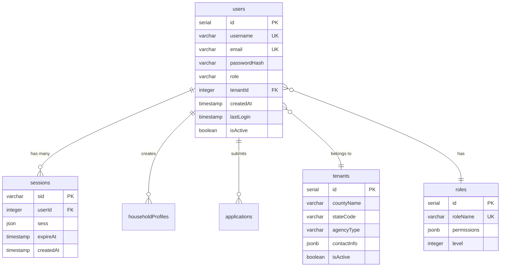

### Key Features
- **Password Security**: bcrypt hashing (cost factor: 12)
- **Session Management**: PostgreSQL-backed with 24-hour expiration
- **Multi-Tenant Isolation**: Row-level security via tenantId
- **Role-Based Access**: 4 roles (Applicant, Navigator, Caseworker, Admin)

---

## 💰 Benefits Programs Schema

### Overview

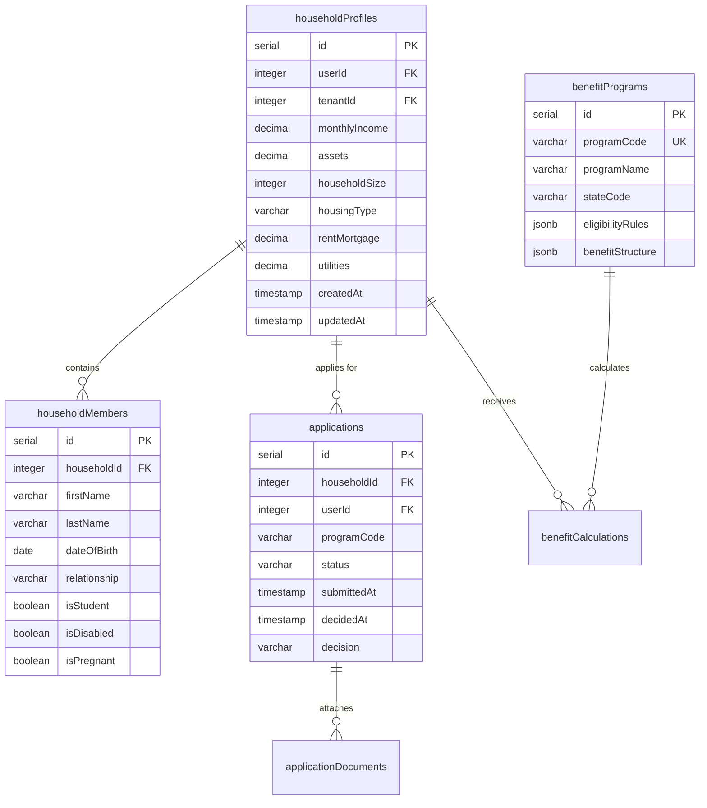

### SNAP (Supplemental Nutrition Assistance Program)

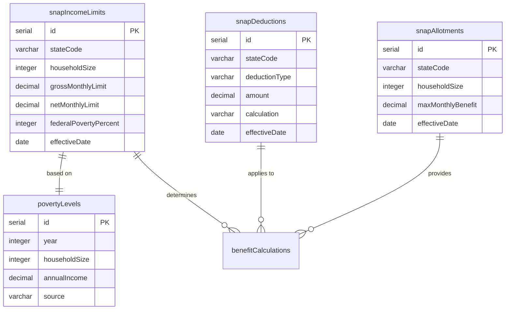

### Medicaid Schema

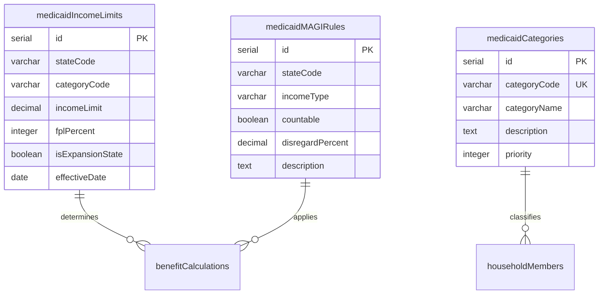

### TANF, OHEP, Tax Credits (Simplified)

```
TANF (Temporary Assistance for Needy Families):
  - tanfIncomeLimits (state-specific income thresholds)
  - tanfAssetLimits (countable resources limits)
  - tanfWorkRequirements (work participation rules)
  - tanfTimeLimits (lifetime benefit limits)

OHEP (Office of Home Energy Programs):
  - ohepIncomeLimits (heating assistance income limits)
  - ohepBenefitTiers (benefit amount by tier)
  - ohepSeasonalFactors (seasonal adjustments)

Tax Credits (EITC, CTC, ACTC):
  - eitcTables (Earned Income Tax Credit calculations)
  - ctcRules (Child Tax Credit eligibility)
  - actcRules (Additional Child Tax Credit refundability)
```

---

## 📄 Tax Preparation Schema

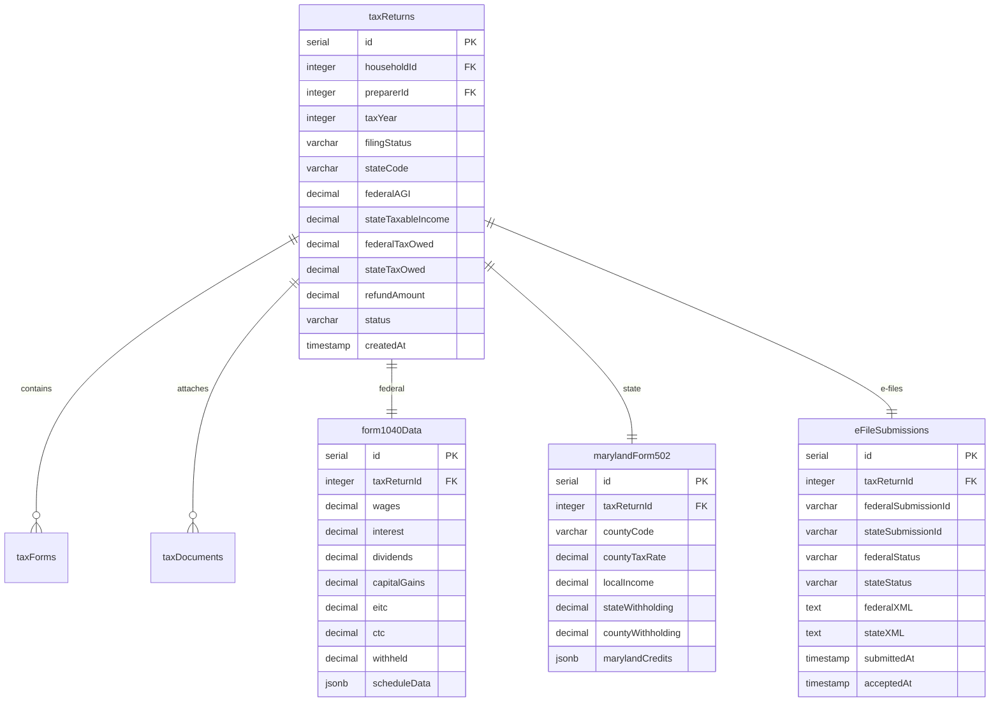

### Multi-State Tax Forms

| State | Form | Status | Fields |
|-------|------|--------|--------|
| Maryland | Form 502 | ✅ Production | `marylandForm502` table |
| Pennsylvania | PA-40 | 🔄 Ready | `pennsylvaniaPA40` table (pending) |
| Indiana | IN-40 | 🔄 Ready | `indianaIN40` table (pending) |
| Michigan | MI-1040 | 🔄 Ready | `michiganMI1040` table (pending) |
| Virginia | VA-760 | 🔄 Ready | `virginiaVA760` table (pending) |
| Utah | TC-40 | 🔄 Ready | `utahTC40` table (pending) |

---

## 🤖 AI & Document Intelligence Schema

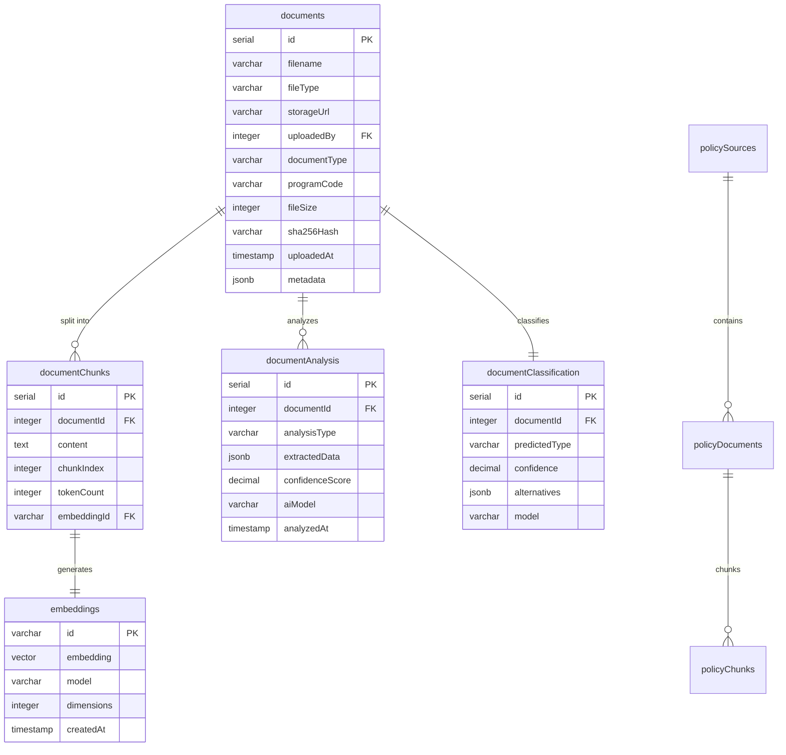

### RAG (Retrieval-Augmented Generation) System

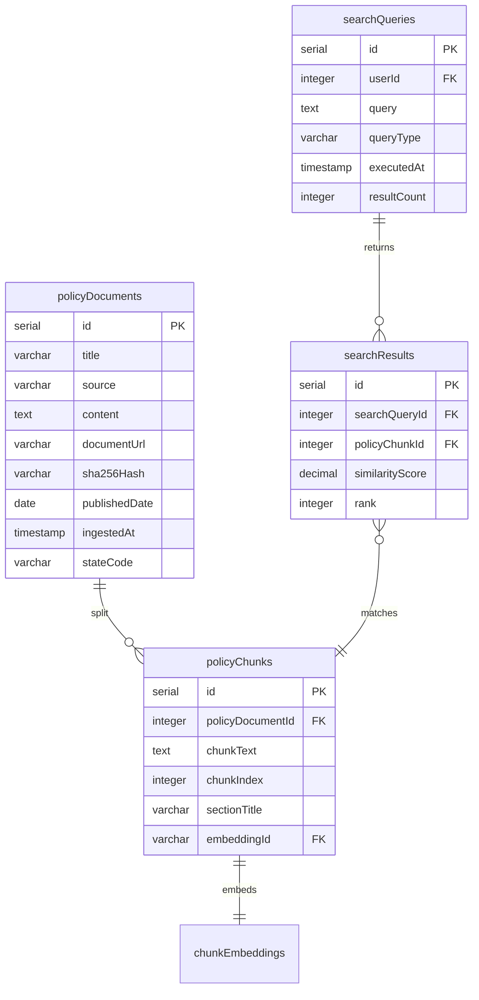

### AI Intake Assistant

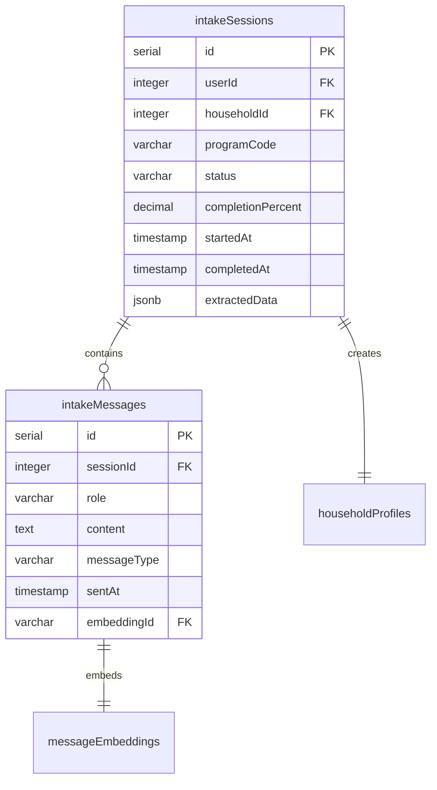

---

## 🎯 Benefits Access Review (BAR) System

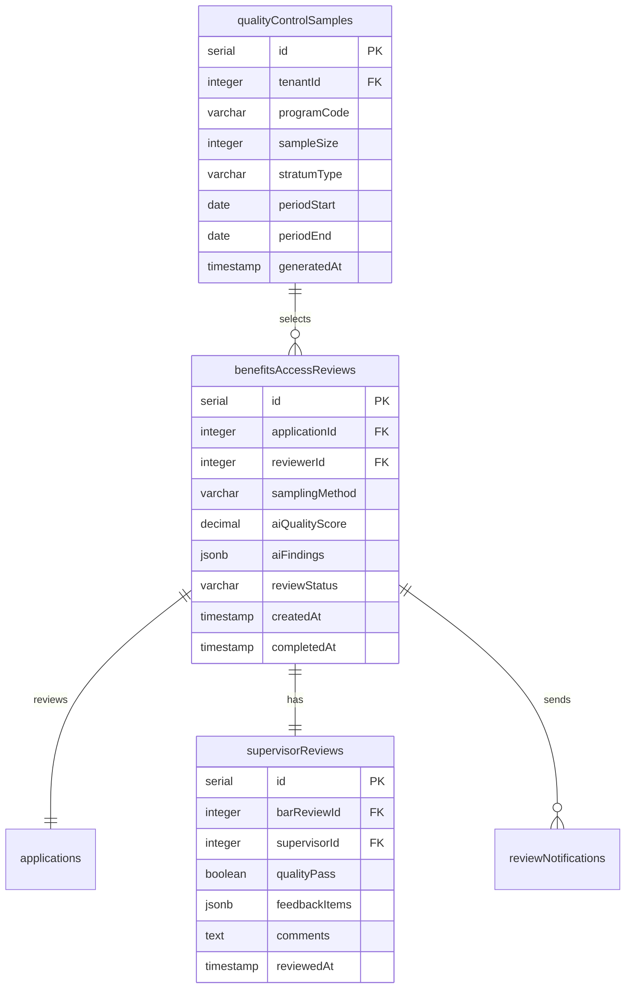

---

## 🏢 Multi-Tenant & State Configuration

```mermaid
erDiagram
    stateConfigurations ||--o{ tenants : "governs"
    stateConfigurations ||--o{ stateBenefitThresholds : "defines"
    stateConfigurations ||--o{ stateTaxRules : "contains"
    tenants ||--|| tenantBranding : "customizes"
    tenants ||--o{ users : "contains"
    
    stateConfigurations {
        serial id PK
        varchar stateCode UK
        varchar stateName
        varchar abbreviation
        boolean medicaidExpanded
        decimal flatTaxRate
        jsonb progressiveTaxBrackets
        jsonb programsEnabled
        varchar timezoneCode
        boolean isActive
    }
    
    tenants {
        serial id PK
        varchar countyName
        varchar stateCode FK
        varchar agencyType
        varchar contactEmail
        varchar contactPhone
        jsonb officeHours
        boolean isActive
    }
    
    tenantBranding {
        serial id PK
        integer tenantId FK UK
        varchar headerText
        varchar logoUrl
        varchar primaryColor
        varchar secondaryColor
        varchar welcomeMessage
        jsonb customStyles
    }
    
    stateBenefitThresholds {
        serial id PK
        varchar stateCode FK
        varchar programCode
        jsonb incomeLimits
        jsonb assetLimits
        date effectiveDate
    }
```

---

## 📊 Monitoring, Metrics & Caching

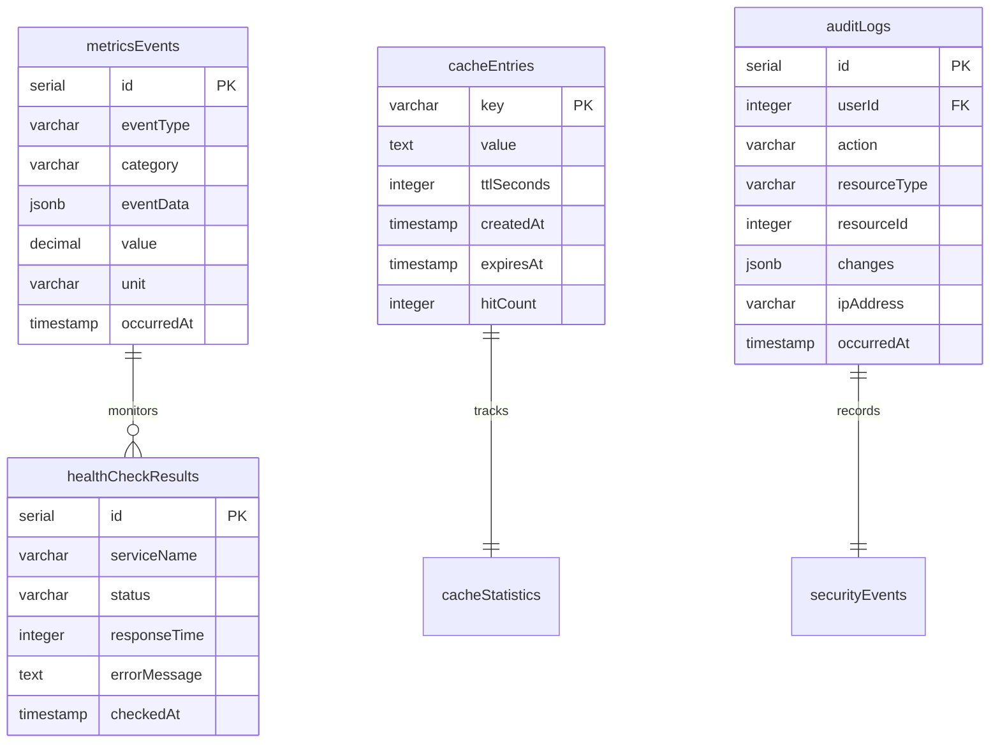

### Caching Strategy

| Cache Type | TTL | Purpose |
|------------|-----|---------|
| **Gemini Embeddings** | 30 days | Document similarity search |
| **RAG Queries** | 7 days | Policy search results |
| **PolicyEngine Results** | 24 hours | Benefit calculations |
| **Document Analysis** | 14 days | OCR and classification |
| **State Configuration** | 5 minutes | Multi-tenant settings |

---

## 🔒 Compliance & Security Tables

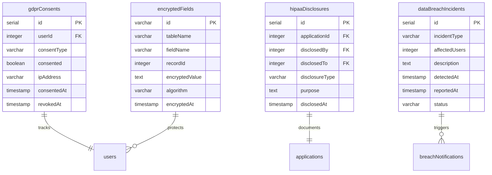

---

## 📈 Indexes & Performance Optimization

### High-Traffic Query Indexes

```sql
-- User authentication lookups
CREATE INDEX idx_users_email ON users(email);
CREATE INDEX idx_users_username ON users(username);
CREATE INDEX idx_sessions_user_id ON sessions(userId);

-- Household & applications
CREATE INDEX idx_applications_household_id ON applications(householdId);
CREATE INDEX idx_applications_status ON applications(status);
CREATE INDEX idx_household_members_household_id ON householdMembers(householdId);

-- Documents & AI
CREATE INDEX idx_documents_uploaded_by ON documents(uploadedBy);
CREATE INDEX idx_documents_program_code ON documents(programCode);
CREATE INDEX idx_document_chunks_document_id ON documentChunks(documentId);

-- Multi-tenant isolation
CREATE INDEX idx_users_tenant_id ON users(tenantId);
CREATE INDEX idx_applications_tenant_id ON applications(tenantId);
CREATE INDEX idx_tenants_state_code ON tenants(stateCode);

-- Tax returns
CREATE INDEX idx_tax_returns_household_id ON taxReturns(householdId);
CREATE INDEX idx_tax_returns_tax_year ON taxReturns(taxYear);
CREATE INDEX idx_tax_returns_status ON taxReturns(status);

-- Caching
CREATE INDEX idx_cache_entries_expires_at ON cacheEntries(expiresAt);
CREATE INDEX idx_cache_entries_key_pattern ON cacheEntries(key text_pattern_ops);

-- Audit & compliance
CREATE INDEX idx_audit_logs_user_id ON auditLogs(userId);
CREATE INDEX idx_audit_logs_occurred_at ON auditLogs(occurredAt);
CREATE INDEX idx_audit_logs_action ON auditLogs(action);
```

### Query Performance Targets

| Query Type | Target Time | Index Coverage |
|------------|-------------|----------------|
| User login | < 50ms | username, email |
| Household lookup | < 100ms | householdId, tenantId |
| Benefit calculation | < 500ms | programCode, stateCode |
| Document search | < 200ms | uploadedBy, programCode |
| RAG similarity search | < 1s | vector index (pgvector) |

---

## 🔧 Database Migrations & Management

### Migration Strategy

```bash
# Push schema changes to database (Drizzle ORM)
npm run db:push

# Force push (bypassing warnings)
npm run db:push --force

# Generate migration files (optional)
npm run db:generate

# Run seeds
npm run seed
```

### Seeding Order (Dependencies)

```
1. stateConfigurations (base state data)
2. tenants (county/state agencies)
3. tenantBranding (UI customization)
4. users (demo accounts)
5. benefitPrograms (program definitions)
6. povertyLevels (federal poverty guidelines)
7. snapIncomeLimits, snapDeductions, snapAllotments
8. medicaidIncomeLimits, medicaidMAGIRules
9. tanfIncomeLimits, ohepIncomeLimits
10. eitcTables, ctcRules
11. countyTaxRates (Maryland 24 counties)
12. dhsForms (DHS forms library)
```

---

## 📚 Schema Documentation Standards

### Naming Conventions

- **Tables**: camelCase (e.g., `householdProfiles`, `taxReturns`)
- **Columns**: camelCase (e.g., `firstName`, `monthlyIncome`)
- **Foreign Keys**: `{tableName}Id` (e.g., `userId`, `householdId`)
- **Indexes**: `idx_{table}_{column}` (e.g., `idx_users_email`)
- **Constraints**: `{table}_{column}_unique` (e.g., `users_email_unique`)

### Data Type Standards

| Use Case | PostgreSQL Type | Drizzle Type |
|----------|----------------|--------------|
| Primary Keys | `serial` or `varchar` (UUID) | `serial()` or `varchar().default(sql\`gen_random_uuid()\`)` |
| Foreign Keys | `integer` | `integer().references()` |
| Money/Benefits | `numeric(10,2)` | `decimal()` |
| Percentages | `decimal(5,2)` | `decimal()` |
| Dates | `date` | `date()` |
| Timestamps | `timestamp` | `timestamp()` |
| JSON Data | `jsonb` | `jsonb()` |
| Text | `text` or `varchar` | `text()` or `varchar()` |
| Booleans | `boolean` | `boolean()` |

---

## 🔗 Related Documentation

- **[API_ARCHITECTURE.md](./API_ARCHITECTURE.md)** - API endpoints using this schema
- **[SYSTEM_ARCHITECTURE.md](./SYSTEM_ARCHITECTURE.md)** - Overall system design
- **[COMPLIANCE_MATRIX.md](./COMPLIANCE_MATRIX.md)** - GDPR/HIPAA compliance
- **[DEPLOYMENT_GUIDE.md](./DEPLOYMENT_GUIDE.md)** - Database deployment procedures

---

**Schema Version:** 2.0.0  
**Last Updated:** October 23, 2025  
**Total Tables:** 179  
**Database:** PostgreSQL 15+ on Neon Serverless
